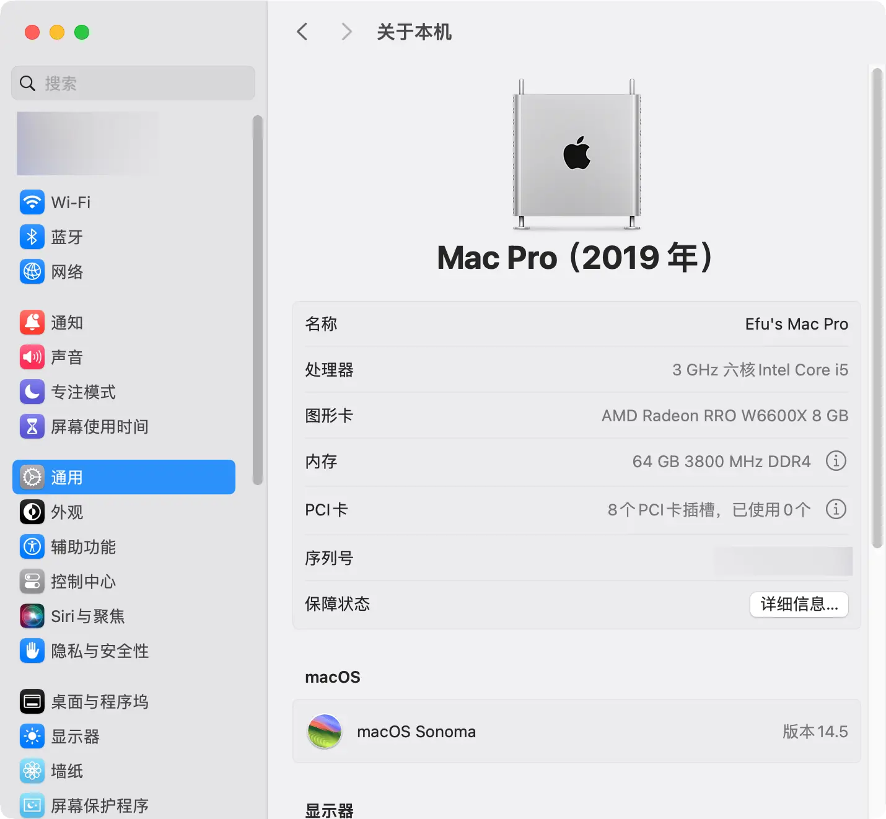
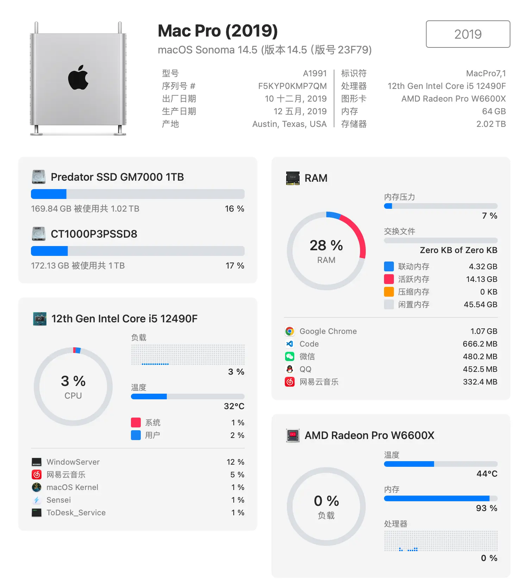
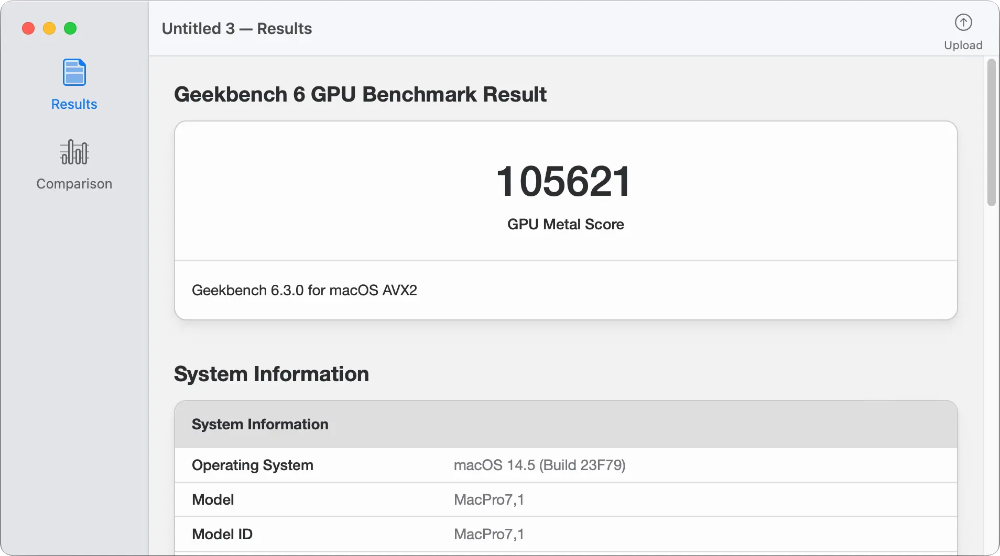

[简体中文](README.zh_CN.md)丨English

# BIOSTAR-B660GTN Hackintosh OpenCore EFI

## OpenCore

[OpenCore 1.0.0](https://github.com/acidanthera/OpenCorePkg)

## OS Version Tested

- macOS Monterey 12.x
- macOS Ventura 13.x
- macOS Sonoma 14.x

## Hardware

- Motherboard: BIOSTAR B660GTN
- Bios Version: B66AY225.BST（2022-02-25）
- CPU: Intel i5-12490F
- RAM: kingbank 2x32GB DDR4 3800MHz
- SSD: 1. CT1000P3PSSD8 1TB MacOS
- SSD: 2. Predator GM7000 1TB Windows
- HDD: Seagate ST1000LM048 DATA
- GPU: Sapphire RX6600
- Audio: Realtek ALC256
- Ethernet: Realtek PCle 2.5GbE Family Controller
- Wireless: Intel AX201
- Display: PHL275E9
- PSU: Delta 500W 1U
- CASE: XiaoZheYouPin A1

## Bios Setup

| Name                                                                        | Option   |
|-----------------------------------------------------------------------------|----------|
| Advenced → CPU Configuration →  C6DRAM                                      | Enabled  |
| Advenced → CPU Configuration →  Intel (VMX) Virtualization Technology       | Enabled  |
| Advenced → SATA Mode Selection                                              | AHCI     |
| Chipset → System Agent (SA) Configuration → Primary Display                 | PCH PCI  |
| Chipset → System Agent (SA) Configuration →  VT-d                           | Enabled  |
| Chipset → System Agent (SA) Configuration →  Above 4GB MMIO BIOS assignment | Enabled  |
| Boot → Boot Configuration → Fast Boot                                       | Disabled |
| Boot → Boot Configuration → CSM Support                                     | Disabled |
| Security → System Mode → Secure Boot                                        | Disabled |
| Tweaker → CPU Power Management → CFG Lock                                   | Disabled |
| Tweaker → GT Power Management → RC6(Render Standby)                         | Disabled |

## Notes

- Use [OCAuxiliaryTools](https://github.com/ic005k/OCAuxiliaryTools) build your SMBIOS

- If you use 12th Gen small core CPU like 12600KF , U must change Config.plist

- Config.plist - Kernel - ProvideCurrentCpuInfo - Ture

   

  

   

## ScreenShot

- About This Mac

    

  

    

- Sensei

    

  

    

- Geekbench6 Score i5-12490F

    

  

    

- Geekbench6 Score Sapphire RX6600 Metal

    

  

    

- Geekbench6 Score Sapphire RX6600 OpenCL

    

  

    

- Case [LZmod F1-1U](https://caseend.com/data/lzmod-studio/lzmod-f1-1u)

  |  |  |
  |------------------------------|------------------------------|
  |  |  |

## Contact Us

- QQ Group: 23304408

