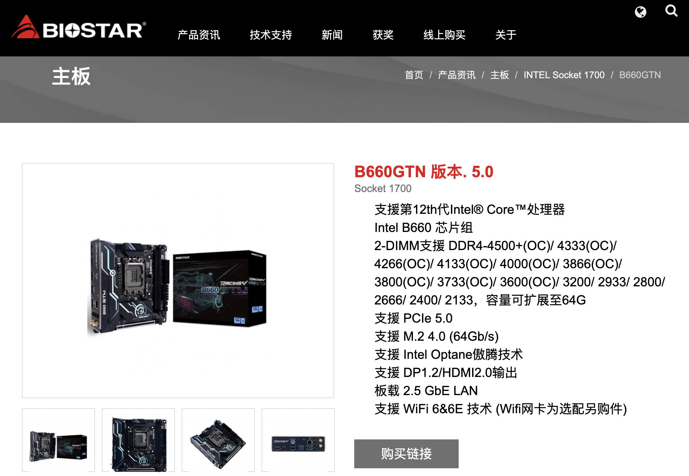
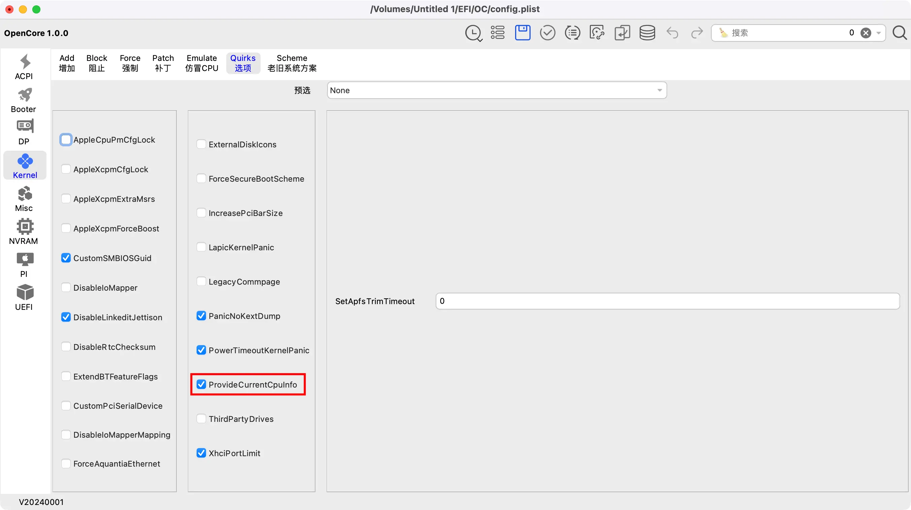
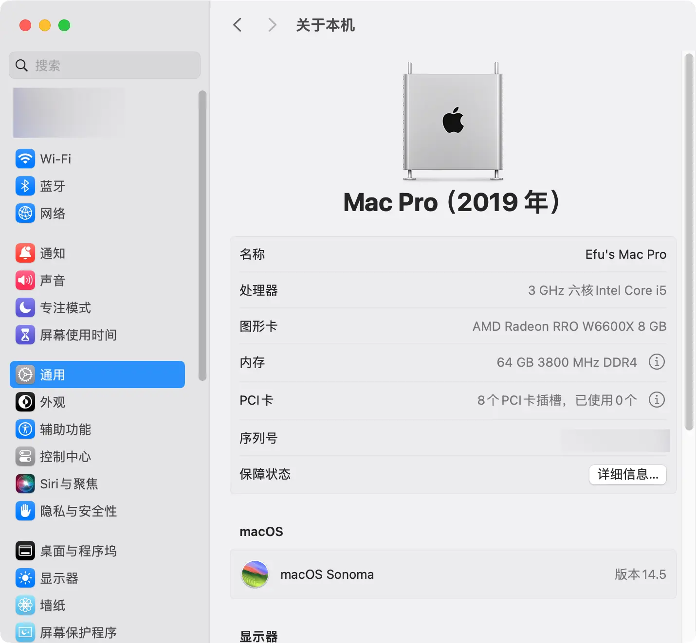
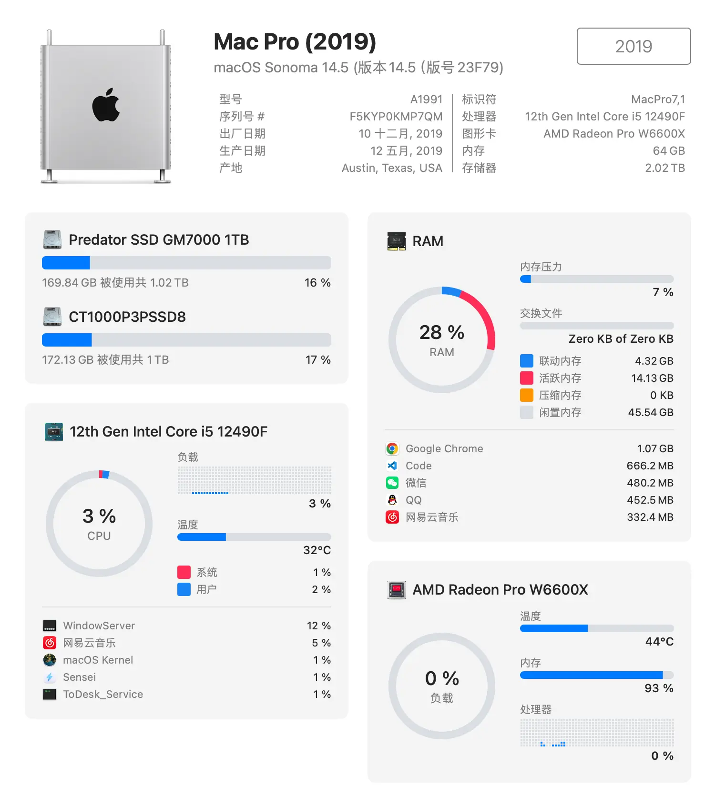
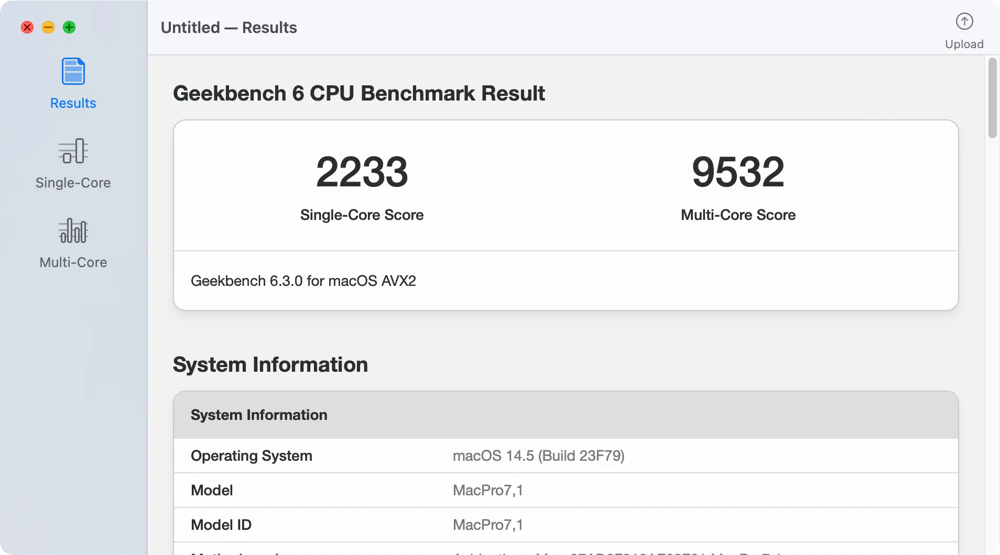
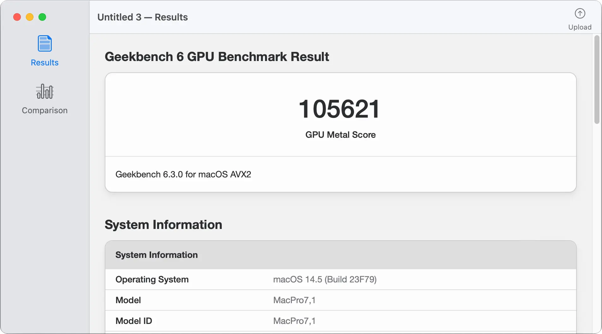
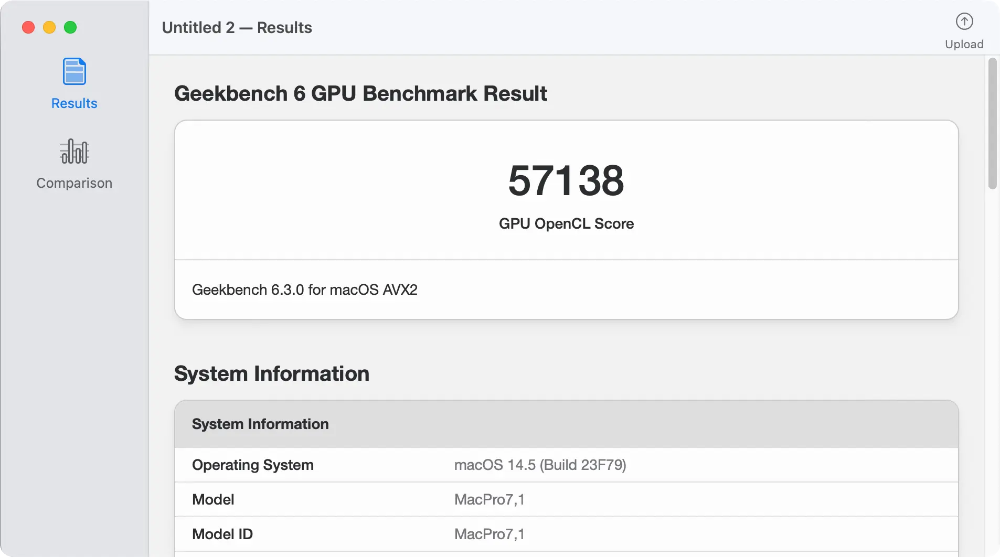

# 映泰B660GTN  黑苹果 OpenCore EFI

### OpenCore

[OpenCore 1.0.0](https://github.com/acidanthera/OpenCorePkg)

### 可安装系统

- macOS Monterey 12.x
- macOS Ventura 13.x
- macOS Ventura 14.x

### 硬件

- 主板: 映泰B660GTN
- Bios版本: B66AY225.BST（2022-02-25）
- 处理器: 英特尔 i5-12490F
- 内存: 金百达 2x32GB DDR4 3800MHz（首批次cjr颗粒，后期出厂混发颗粒不推荐）
- 硬盘: 1.英睿达 P3P 1TB MacOS
- 硬盘: 2.宏碁掠夺者 GM7000 1TB Windows
- 硬盘: 3.希捷酷鱼 ST1000LM048 DATA
- 独显: 蓝宝石 RX6600
- 声卡: 瑞昱 ALC256
- 网卡: 瑞昱 PCle 2.5G网络控制器
- 无线: 英特尔 AX201
- 显示器: PHL275E9
- 电源: 台达 500W 1U
- 机箱: 小喆优品 A1

### Bios 设置

| 名称                                                          | 选项      |
|-------------------------------------------------------------|---------|
| 高级 → CPU配置 → C6DRAM                                         | 启用      |
| 高级 → CPU配置 →  Intel (VMX) Virtualization Technology         | 启用      |
| 高级 → SATA Mode Selection                                    | AHCI    |
| 芯片组 → System Agent (SA)配置 → Primary Display                 | PCH PCI |
| 芯片组 → System Agent (SA)配置 →  VT-d                           | 启用      |
| 芯片组 → System Agent (SA)配置 →  Above 4GB MMIO BIOS assignment | 启用      |
| 启动 → 启动配置 → 快速启动                                            | 禁用      |
| 启动 → 启动配置 → CSM支持                                           | 禁用      |
| 安全 → 系统模式 → 安全启动                                            | 禁用      |
| 调节器 → CPU Power Management → CFG Lock                       | 禁用      |
| 调节器 → GT Power Management → RC6(Render Standby)             | 禁用      |

### 注意事项

- 使用 [OCAuxiliaryTools](https://github.com/ic005k/OCAuxiliaryTools) 生成 SMBIOS

- 如果你使用12代具有小核心的CPU例如12600KF , 请务必修改Config.plist配置文件

- Config.plist - Kernel内核设置 - ProvideCurrentCpuInfo - 勾选

   

  

   

### 系统截图

- 关于本机

    

  

    

- Sensei

    

  

    

- Geekbench6 跑分 i5-12490F

    

  

    

- Geekbench6 跑分 蓝宝石 RX6600 Metal

    

  

    

- Geekbench6 跑分 蓝宝石 RX6600 OpenCL

    

  

    

- 机箱 LZmod F1-1U

  |  |  |
  |------------------------------|------------------------------|
  |  |  |

### 联系我们

- QQ群: 23304408

  

